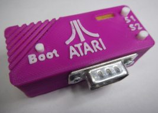
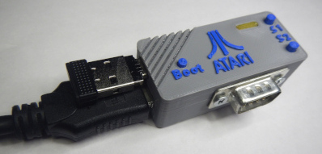

# Case for [MiSTeryNano](https://github.com/harbaum/MiSTeryNano).

## USB-C Breakout Board version

The device case is designed for use with [USB-C Breakout board](https://aliexpress.ru/item/1005005066738201.html)

### Embossed font version for printing upside-down
[.png)](USB-C%20Breakout-Case%20(embossed).stl)

## M0S Dock version

*© prcoder, 2023*
